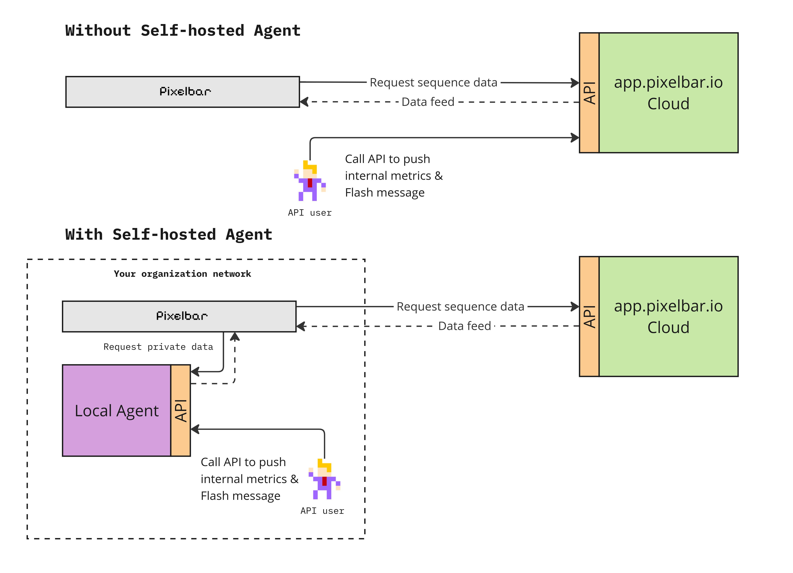

# Pixelbar Agent

[](https://opensource.org/licenses/MIT)
[](https://www.python.org/downloads/)
[](https://github.com/psf/black)

The self-hosted Agent is a secure, self-hosted solution that enables organizations to display Flash messages and internal KPIs on their Pixelbar displays without sending data outside their private network.
 
## Overview

The self-hosted Agent acts as a bridge between your internal systems and Pixelbar displays, allowing you to:

- Broadcast important announcements and Flash messages to your team
- Display real-time KPIs and metrics from internal systems
- Maintain complete data privacy with no external API calls
- Ensure compliance with strict security requirements




## Features

- Provides dedicated endpoints for screen-specific operations:
  - Flash message endpoint: `/api/{screenid}/flash-message/`
  - Hot data endpoint: `/api/{screenid}/hotdata/`

  
- Secure API authentication
- Customizable display settings
- Low resource footprint
- [API documentation](https://app.pixelbar.io/api-docs/agent-intro/) available online

## Getting Started

### Prerequisites

- Python 3.10+
- Docker (optional, for containerized deployment)
- Pixelbar display hardware

### Installation

1. Clone the repository:
   ```bash
   git clone https://github.com/pixelbar/self-hosted-agent.git
   cd self-hosted-agent
   ```

2. Install dependencies:
   ```bash
   pip install -r requirements.txt
   ```

### Configuration

Create a `.env` file in the project root or set environment variables:

```
# Example .env file
PORT=8000
HOST=0.0.0.0
LOG_LEVEL=info
# Check https://app.pixelbar.io/settings/self-hosting/ for your API key
PIXELBAR_API_KEY=your_secret_key_here

# Add other configuration options as needed
```

### Running the Application

#### Using Docker (recommended):

```bash
docker pull singularbyte/pixelbar-onprem-agent:latest
docker-compose up -d
```

A `docker-compose.example.yml` file is provided in the repository that you can use as a template:
```bash
cp docker-compose.example.yml docker-compose.yml
# Edit docker-compose.yml to update your settings
# Specifically set your PIXELBAR_API_KEY value
```

Alternatively, you can build and run using:
```bash
make build
make docker-run
```

#### Using Python directly:

```bash
uvicorn app.main:app --reload --host 0.0.0.0 --port 8000
```


## API Documentation


### Authentication

API requests require authentication using an API key:

```
http://{pixelbar-agent.local}/?apikey={your api key}
```

You can generate this API Key in your settings space on https://app.pixelbar.io/settings/self-hosting/ 

### Endpoints

See https://app.pixelbar.io/api-docs/agent-api-endpoints/


## Development

### Code Style

This project uses Black for code formatting and Flake8 for linting:

```bash
# Format code
make format

# Lint code
make lint
```

### Testing

Run tests with pytest:

```bash
pip install -r requirements.dev.txt
make test
```

Generate a coverage report:
```bash
make coverage
```

## Contributing

Contributions are welcome! Please feel free to submit a Pull Request.

## Project Status

This project is actively maintained. We welcome feedback and contributions from the community.

## Support

For support or questions, please:

- Open an issue on GitHub
- Contact us at support@pixelbar.io
- Visit our application at [https://app.pixelbar.io](https://app.pixelbar.io)

## License

This project is licensed under the MIT License - see the [LICENSE](LICENSE) file for details.